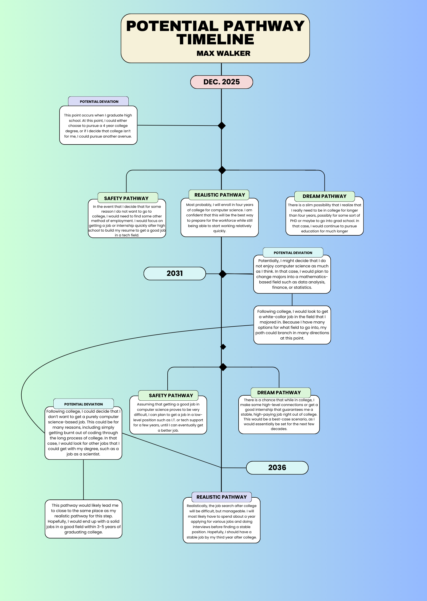

This timeline is meant to show my idea of some of the pathways I can potentially take through life. Because the future in inherently uncertain, it is likely that the path I will actually take differs slightly or majorly from the paths on this timeline. 
The timeline starts at the present, when I am in high school as a junior. It diverges into three pathways, representing the choices I can make after high school. My options at this point are:
1. Not go to college
2. Enroll in a university in order get a 4-year bachelor's degree in computer science
3. Enroll in a univerity in order to get a 4+ year high-level degree in computer science
4. Enroll in university in a field unrelated to computer science
The reason so many of my pathways involve computer science is because it seems like the most interesting career I can go into, given all of the career's i've been exposed to. However, it is possible that I discover another field that I am more interested in, in which case I would study that in college

After college, I would begin looking for a job in the field I studied. In my timeline, I used computer science as the field I would go into, but I am still not  100% certain about this.
The options after this point are:
1. The job search is very difficult, due to either picking a career with an extremely competitive job market, or simply being unlucky. In this case, it would likely take me a long time to find a job, but I would try my hardest and also consider working in a slightly different field.
2. The job search is moderately difficult, leading to me getting a job within a year of graduating college. This is, in my opinion, the most likely outcome, which would hopefully have me making a steady paycheck.
3. The job search is extremely easy, likely due to me making lucky connections in college that guarantee me a job right out of college. This would be extremely beneficial to me, as I could start making money and improving my career very fast. 

---
[About Me](./AboutMe.md) | [Job Opening](./JobOpening.md) | [Potential Pathway Timeline](./Timeline.md) | [Networking QA Experience](./NetworkingQA.md) | [Personal Blog](./Blog.md) | [Home](./) | [Smart Goal](./SmartGoal.md)

